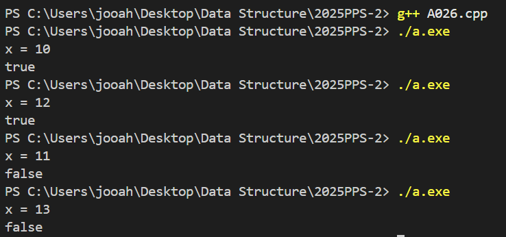

# PPS Camp C++ week2
22100480 / 윤주안

## A021. 플러그

등차수열을 이용해서 풀었다.
합계 sum = (모든플러그수) - (멀티탭수-1)
이 공식을 적용하여 해답을 구할 수 있었다. 

## A022. 핸드폰요금

각각의 가격이 반영되는 시간은 Y는 59, M은 119이다. 
주어진 시간이 이 시간을 초과하는 경우가 발생할 수 있으므로 처음에 
Y는 59로 M은 119로 나누어야한다. 나누었을때 몫이 0이 나오는 경우는 
각각 Y은 59보다 작음을, M은 119보다 작음을 의미한다. 그렇기에 
그다음 기준인 나머지가 30보다 같거나 큰지, 60보다 같거나 큰지를 판별하면 된다.
만약 몫이 0보다 크다면, 몫에다가 각각 20, 30을 곱하고 나머지를 위와 동일한 조건으로 판별하면 된다.  

## A023. Add Digits

각 자릿수를 더해줘야하기에 num을 10으로 나눠주고 
나머지를 계속해서 더해준다. num이 0보다 작아지면
각 자릿수를 더한 sum을 다시 반환하는데 이때 sum이 
10보다 작은 한자리수가 되는 경우에 반복문을 빠져나간다. 

## A024. Lemonade Change

5(f), 10(t) 지폐의 갯수만 세면 된다. 
(1) 5가 들어오는 경우 : f를 1증가한다. 
(2) 10이 들어오는 경우 : f를 1감소, t를 1증가한다.
(3) 20이 들어오는 경우 : f < 1 또는 t < 1인지 먼저 판별한다. 
현재 지폐갯수가 10, 5가 있는지를 먼저 판별해야 다음에 5를 덜 소멸시킬 수 있음.(해당X 바로 f와 t를 각각 1감소시킴)
5 5 5를 먼저하게되면 나중에 계산할때 5가 없어서 false가 나올 수 있음.
그다음에 f < 3인지 판별 해당하는 경우 false를 반환. 그렇지 않은 경우 f를 3감소시킴. 
bills.size()까지 모두 확인했으면 반복문을 빠져나와 true를 반환시킴

## A025. Power of Four

입력받은 수가 1이면 true 반환
아이디어 : 4를 계속해서 곱해서 같아지는 경우 true 반환
4를 곱한 값이 원래 입력받은 수보다 커지면 그대로 반복문 종료 false 반환. 

## A026. 하샤드 수

x의 각 자릿수의 합을 구하기 위해 
X를 0보다 클때까지(0이되면 더해봤자 0) 10으로 나눈 나머지를 더해주고
10으로 나눈다. 그러면 기존 x값이 사라지므로 초기에 num = x;를 하여 x값을 저장한다.
num을 sum으로 나눴을때 0이 아니라면 answer = false를 대입한다. 

## A027. 큰 수 만들기

## A028. 큰 수 A+B

## A029. 문문문

## A030 좋은 날 싫은 날
         