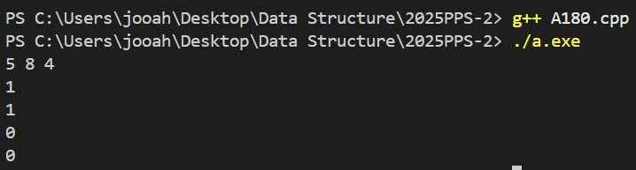

# PPS Camp C++ week2
22100480 / 윤주안

## A021. 플러그

등차수열을 이용해서 풀었다.
합계 sum = (모든플러그수) - (멀티탭수-1)
이 공식을 적용하여 해답을 구할 수 있었다. 

## A022. 핸드폰요금

각각의 가격이 반영되는 시간은 Y는 59, M은 119이다. 
주어진 시간이 이 시간을 초과하는 경우가 발생할 수 있으므로 처음에 
Y는 59로 M은 119로 나누어야한다. 나누었을때 몫이 0이 나오는 경우는 
각각 Y은 59보다 작음을, M은 119보다 작음을 의미한다. 그렇기에 
그다음 기준인 나머지가 30보다 같거나 큰지, 60보다 같거나 큰지를 판별하면 된다.
만약 몫이 0보다 크다면, 몫에다가 각각 20, 30을 곱하고 나머지를 위와 동일한 조건으로 판별하면 된다.  

## A023. Add Digits

각 자릿수를 더해줘야하기에 num을 10으로 나눠주고 
나머지를 계속해서 더해준다. num이 0보다 작아지면
각 자릿수를 더한 sum을 다시 반환하는데 이때 sum이 
10보다 작은 한자리수가 되는 경우에 반복문을 빠져나간다. 

## A024. Lemonade Change

5(f), 10(t) 지폐의 갯수만 세면 된다. 
(1) 5가 들어오는 경우 : f를 1증가한다. 
(2) 10이 들어오는 경우 : f를 1감소, t를 1증가한다.
(3) 20이 들어오는 경우 : f < 1 또는 t < 1인지 먼저 판별한다. 
현재 지폐갯수가 10, 5가 있는지를 먼저 판별해야 다음에 5를 덜 소멸시킬 수 있음.(해당X 바로 f와 t를 각각 1감소시킴)
5 5 5를 먼저하게되면 나중에 계산할때 5가 없어서 false가 나올 수 있음.
그다음에 f < 3인지 판별 해당하는 경우 false를 반환. 그렇지 않은 경우 f를 3감소시킴. 
bills.size()까지 모두 확인했으면 반복문을 빠져나와 true를 반환시킴

## A025. Power of Four

입력받은 수가 1이면 true 반환
아이디어 : 4를 계속해서 곱해서 같아지는 경우 true 반환
4를 곱한 값이 원래 입력받은 수보다 커지면 그대로 반복문 종료 false 반환. 

## A026. 하샤드 수

x의 각 자릿수의 합을 구하기 위해 
X를 0보다 클때까지(0이되면 더해봤자 0) 10으로 나눈 나머지를 더해주고
10으로 나눈다. 그러면 기존 x값이 사라지므로 초기에 num = x;를 하여 x값을 저장한다.
num을 sum으로 나눴을때 0이 아니라면 answer = false를 대입한다. 

## A027. 큰 수 만들기

string number에서 한개씩 꺼내서, 
push하기전에, string answer이 비어있지않고, 맨뒤에 있는 char값이 현재 char값보다 작은경우, 
k가 0보다 큰 경우에는 pop_back를 하고 k를 1감소한다. 
answer.push_back한다. 
8765처럼 앞에 자릿수가 무조건 더 커서 k를 하나도 감소시키지 못하고 push만 한경우에는
맨 뒤에가 가장 작은수이기에 뒤에서부터 k만큼 pop_back한다. 

## A028. 큰 수 A+B

string a, b를 비교해서 둘을 더할려면 일단 자릿수를 맞춰야한다. 
둘의 length를 비교한다. 작은수는 앞에 0으로 채운다.
각 자릿수를 int로 변환한 다음 더한 값 sum을 10으로 나눈다. 
이것이 carry가 되고 carry가 있다면 숫자를 문자로 변환한다. 
결과가 거꾸로 저장되기에 reverse한다. 

## A029. 문문문

문의 갯수와 첫번째 선택을 입력받는다. 
첫번째 문을 여는 방식이 1이면 0101...순으로 저장, 0이면 반대로 저장.
내 아이디어는 arr[0] = 1을 해놓고, 2의 배수가 모두 같은지, 3의 배수가 모두 같은지 판별
다른 경우에 arr[0] = 0 대입. vector<int> num에서 num[0]이 0인경우 
"Love is open door"출력, 아닌 경우에는 num[2]부터 n번째까지 출력한다. 

## A030 좋은 날 싫은 날
  
시작이 좋은 날, good = 1.0, bad = 0.0
시작이 나쁜 날, good = 0.0, bad = 1.0로 초기화한다.
공식 사용.
new_good = good * n1 + bad * n3; (good에 해당)
new_bad = good * n2 + bad * n4; (bad에 해당)
출력은 1000을 곱하고 0.5를 더해줌으로써 반올림이 되도록 한다. 

## A031 초콜릿 자르기
  
공식만 찾으면 된다. 
n, m을 입력받고 
n에 m을 곱하고 1을 뺀값을 출력한다. 

## A032 부녀회장이 될테야

예를 들어 2층 3호를 찾는다면 (1층1호+1층2호+1층3호)이기에
역순으로 돌아가는 것라서 recursive을 사용해야겠다는 생각이 들었다.
k가 0이면 i호에 i명이기에 return n을 한다. 
k-1호의 i번째를 i를 계속 1씩 증가하면서 sum에 추가한다. 
sum을 반환한다. 

## A033 나는 요리사다
  
max값을 0, max값을 갖는 index도 0으로 초기화한다. 
각 참가자별로 총점을 구해서 num[i]에 집어넣는다. 
만약 num[i]가 max보다 크면 max = num[i]를 대입, max_i = i를 집어넣는다. 
i는 0부터 시작하기에 number 출력할때 1을 더해서 출력한다. 

## A034 나머지
  
int rest[42]배열을 만든다(나머지 0~41 확인하도록)
값을 입력받고 나머지값 r를 index로 하여 rest[r]를 1증가시킨다.
최종적으로 rest 배열을 확인하며 값이 0보다 큰경우 count를 1증가시킨다.
count을 출력한다. 

## A035 화성 수학
  
istringstream을 사용하여 공백을 기준으로 값을 입력받는다. 입력받은 값이 @, %, #에 따라
num을 계산하고 출력한다. fixed << setprecision(2)를 사용하여 소수점 둘째자리까지 출력한다. 

## A102 Transpose Matrix
  
']'를 기준으로 row를 잘라서 rowStr에 저장한다. rowStr에 마지막으로 나타난 '['의 위치를 idx에 저장한다. 
idx +1을 하여 '[' 다음에 오는 문자열을 잘라낸다. 숫자로 읽기 위해 stream으로 바꾸고 숫자를 하나씩 읽어들여서 row에 push한다. 
함수에서는 2중 배열이므로, matrix.size()를 row로, 첫번째 배열의 size를 col로 하여 matrix 배열을 읽어들이고, 
result에 col와 row를 반대로 하여 저장시킨다. 

## A104 욱제는 효도쟁이야!!
  
왼쪽으로 돌거나, 오른쪽으로 돌거나 둘중 하나이지만, 
아이디어는 가장 큰 수만 안 지나도록 돌면 되는 것이므로
가장 큰 max값만 찾아내서 전체를 다 더한 sum에 빼면 된다. 

## A105 분수찾기
  
규칙을 찾아야되는데, i와 j둘다 1부터 시작, 처음에는 지그재그로 증가하는 줄 모르고 
i내부에서 j를 계속 증가하는 방식으로 풀었는데, 다시보니 지그재그 증가여서,
홀수일때는 위에서 아래로 j증가, 짝수일때는 아래에서 위로 j증가하도록 코드를 구성. 
count가 사용자가 입력한 n과 일치하면 즉시 출력하고 반복문을 종료하도록 하였다. 

## A107 쉽게 푸는 문제
  
시작값과 끝값을 입력받고, sum, count를 0으로 초기화한다.
count를 1증가하고 num배열에 i를 더한다. 그리고 그값을 그대로 sum에 더해준다. 
count가 사용자가 입력한 끝값과 일치하게 되면, 
현재 sum값에서 시작값 직전까지의 배열값을 전부 빼준다.

## A108 수 뒤집기
 
값을 입력받고, reverse하는 작업을 진행한다. reverse는 while입력받은 숫자가 0보다 클때,
d = 값 10으로 나눈 나머지, b에는 현재 b의 값을 10을 곱하고 d를 추가하여 reverse작업을 한다.
num을 10으로 나누어서 결국에 반복문을 빠져나가도록 한다. 
아이디어는 입력받은 값과 reverse한 값을 더한 값을 또 reverse해서 같으면 Yes를 다르면 No출력
위의 과정을 b만 a와 b를 더한 last값으로 바꾸어서 반복한다. 

## A110 거스름돈
 
배열을 만들어서 500부터 1까지 엔화 순서대로 집어넣었다. 
원리는 나누었을때 몫은 count하고, 나머지는 그다음 값이 된다. 
이것을 값이 0이 되거나 i가 엔화 1원까지 나누는 것을 끝내는경우 
둘중 하나에 해당하면 종료하고 출력하면 된다. 

## A115 Maximum Number of Balloons
 
소문자는 ascii code에서 총 26개다. 
list[26] = {0};으로 초기화하고, 사용자가 입력한 문자열에서 한개씩 꺼내서
list[ch - 'a']++를 한다. a는 소문자의 첫번째 자리이다.  
b a l o n의 갯수를 확인하면 되는데 l, o는 두번 나오므로 나누기 2를 해줘야한다. 
최솟값을 return한다. 

## A118 Move Zeros
 
0이면 현재 자리를 erase하고
맨 뒤에 0을 push_back하면 된다. 
바뀐 전체를 출력시킨다. 

## A122 Rotate String
 
s = s.substr(1) + s[0];를 사용하여
첫번째 자리의 문자를 맨뒤로 보내주고 나머지와 합쳐서
전체 문장이 goal와 같은지를 비교한다. 

## A123 1로 만들기
 
dp[i]는 최소 연산 횟수, i = 1이면 0
2부터 N번 반복, 
1만 빼는 연산을 하는 경우, 
2로 나누어떨어지는 경우, i / 2를 하고 +1을 추가 
3로 나누어떨어지는 경우, i / 3를 하고 +1을 추가 
비교해서 더 작은 값을 dp[i]에 집어넣는다.   

## A124 소인수분해
 
소인수분해를 할때 2부터 증가하며, 
한쌍의 약수를 찾으면 다른 하나도 찾은것이기에 sqrt(n)이 된다. 
i * i <= n인 경우가 최적화조건이 된다. 
n이 i로 나누어떨어지면 i를 출력하고, n을 i로 나눈값이 n이 된다. 
만약 반복문을 종료했는데 n > 1보다 큰경우에는 
소수가 남아있는것이기에 n을 출력한다. 

## A126 한수
 
함수를 역할별로 구분한다. 등차수열인지를 확인하는 check, 그수를 세는 count
애초에 두자리면 무조건 등차수열이기에 num.size() < 3을 판별한다. 
처음에 num[1] - num [0]을 확인해서 증감 범위를 확인한다. 
다르면 즉시 false를 반환. false가 아닌 true가 반환된 경우만 count를 1증가한다. 

## A127 최소공배수
 
함수로 a,b 인자로 보내고 a,b를 비교하여 더 큰수를 big, 작은수를 small에 대입한다.
만약 a와 b가 같으면 바로 출력한다. 
result는 big에서 출발해야하므로, result에 big를 대입하고 
result를 a와 b로 나누었을때 모두 나누어떨어지는 경우 result를 반환한다. 
나누어떨어지지않는경우 big값을 계속해서 더하면서 확인한다. 

## A130 제로
 
입력받은 수를 vector<int>g로 모두 함수에 보내준다.
새로운 vector<int>result를 만들고
nums[i]가 0이면 result의 맨 뒤의 자리를 pop시킨다. 
0이 아니면 현재 nums[i]를 result에 push_back한다. 
새롭게 만들어진 result의 원소를 하나씩 꺼내서 
sum에 더한다. sum을 출력한다. 

## A135 베스트셀러
 
map<string, int>m을 사용하여 string이름과 빈도수가 한쌍으로 묶이도록 한다. 
g에서 한개씩 꺼내서 strign s에 집어넣은후 m[s]의 빈도수를 1씩 증가시킨다. 
max값과 max_name을 초기화한후, m을 한개씩 확인해보며 빈도수 p.second값이 max보다 크면
max값을 p.second로 바꾸고, max_name에는 p.first 즉, string값을 집어넣는다. 
마지막으로 가장 높은 빈도수를 가진 max_name을 출력한다. 

## A145 부족한 금액 계산하기  
 
사용자의 부족한 금액 answer는 
price를 i가 1일때 곱한값, 2일때 곱한값 ... count일때까지 곱한값을 더해주고
money를 뺀값을 출력하면 된다. 
answer가 money와 동일하면 동일한 값을 뺐으므로 0이 출력될 것이다. 

## A161 대충만든 자판
 
입력받을때 [ ] "가 나오면 공백을 대입한후, stringstream처리하도록 한다.
처음에 공백이 아닌경우, 마지막에 공백이 아닌경우 둘은 판별하여 string w로 받아서 push_back
최소 횟수 minPress[i], i+1번 눌러야 입력 가능하기에 minPress[idx] = min(minPress[idx], i + 1);
target을 계산할때는 문자를 index로 변환하고, keymap에 존재하는 문자인지 판별한다. 
누르는 횟수는 total에 minPress[idx]를 계속해서 더해주고 최종적으로 push_back한다. 
keymap에 없는 문자가 target에 있으면 -1을 push_back한다. 

## A166 크기가 작은 부분 문자열
 
t와 p를 입력받되 맨 앞뒤 "를 t.erase(0,1) 그리고 t.pop_back으로 지운다. 
p_len으로 p의 length를 입력받고, t를 i부터 p_len까지 substr하여서 계속해서 비교한다.
숫자 나열순과 ascii code순이 같기에 int로 변환하지 않고 string을 그대로 비교해도 괜찮다. 
비교해서 p보다 작거나 같으면 answer를 1 증가한다. 최종적으로 answer를 출력한다. 

## A172 삼총사

string으로 입력받고, int n과 while(iss >> n)을 사용하여 string을 int로 전환하여 push_back한다.
3개의 합이 0인지를 판별하기 위해 첫번째 원소 i, 두변째 원소는 i보다 1개 큰 j, 세번째 원소는 j보다 1개 큰 k에서 시작해서 중복없이 모든 경우의 수를 확인하는 3중 루프이다. 합이 0이면 answer를 증가하고,
최종적으로 answer를 출력한다. 

## A173 없는 숫자 더하기
 
아이디어는 a[10] = {0};으로 하고, numbers[i]값을 a의 index값으로 받아서
값이 존재하는 경우 a[numbers[i]]++한다. 최종적으로 array a를 확인하여 값이 0인경우
answer에 i를 더한다. answer를 출력한다. 

## A176 나머지가 1이 되는 숫자 구하기
 
0,1은 나눴을때 나머지가 1이 나올 수가 없기에, i는 2부터 시작해서 n보다 1작을때까지를 
i의 범위로 하여, n에서 i를 계속해서 나누고 나머지가 1이 되는 즉시 return해서 
i의 최솟값이 return 되도록 한다. n보다 1작은 값은 무조건 나눴을때 나머지가 1이 되기에
무조건 i가 return된다. 

## A179 1998년생인 내가 태국에서는 2541년생?
 
y이 제한범위가 1000이상 3000이하이기에 
입력된 y값이 1000 미만, 3000 초과인 경우에는 올바른 입력을 받을때까지
while반복문을 사용한다. y에 543을 뺀 값을 출력한다. 

## A180 나머지
 
a, b, c를 입력받고 각각의 식을 계산한 값을 result1부터 4까지 순서대로 대입한다.
계산한 값을 출력한다. 

## A181 곱셈
 
3자리수 두개 a, b를 입력받는다. 
아이디어는 a에다가 b의 일의 자리를 곱한값, 10의 자리를 곱한값, 100의 자리를 곱한 값을 출력하고,
마지막에는 원래 b를 곱한 값을 출력하는데, 마지막에 b의 원래값을 곱해주기위해 origin에 b를 저장,
arr[i]로 b를 10으로 나눈 나머지를 저장하고, b를 10으로 나눠준다. 
최종적으로 a에 arr[i]를 곱한 값을 출력하고 마지막으로 origin을 곱한 값을 출력한다. 

## A182 꼬마 정민
 
정수 a, b, c를 입력받는다. int sum에 a + b + c의 값을 저장,
sum을 출력한다. 

## A183 고양이
 
출력 문자 그대로 출력하되 백슬래시는 이스케이프 문자이므로 두번 출력해야한다.
다음 줄로 이동하도록 endl을 사용했다. 

## A184 개
 
출력 문자 그대로 출력하되 백슬래시는 이스케이프 문자이므로 두번 출력해야하며.
특히 세번째 줄에서 "" 안에 "를 집어넣기 위해서는 \"를 사용해야 한다. 
다음 줄로 이동하도록 endl을 사용했다. 

## A185 두 수 비교하기
 
정수 a, b를 입력받는다. if a가 b보다 큰 경우 ">" 출력
else if a가 b보다 작은 경우 "<"출력, 그 외의 경우는 같기에 "=="를 출력한다. 

## A186 시험 성적
 
아이디어는 위에서부터 아래로 큰수를 조건으로 비교하여 해당하는 경우 바로 출력하도록 한다.
90이상이 A이기에 맨처음에 grade가 90보다 크거나 같은지를 비교하고, 그다음에 
grade가 90이상이 아니면서 80이상인경우 B를 출력하도록 한다. 동일한 방식으로 D까지 출력하고, 그외의 경우 F를 출력한다. 

## A192 합
 